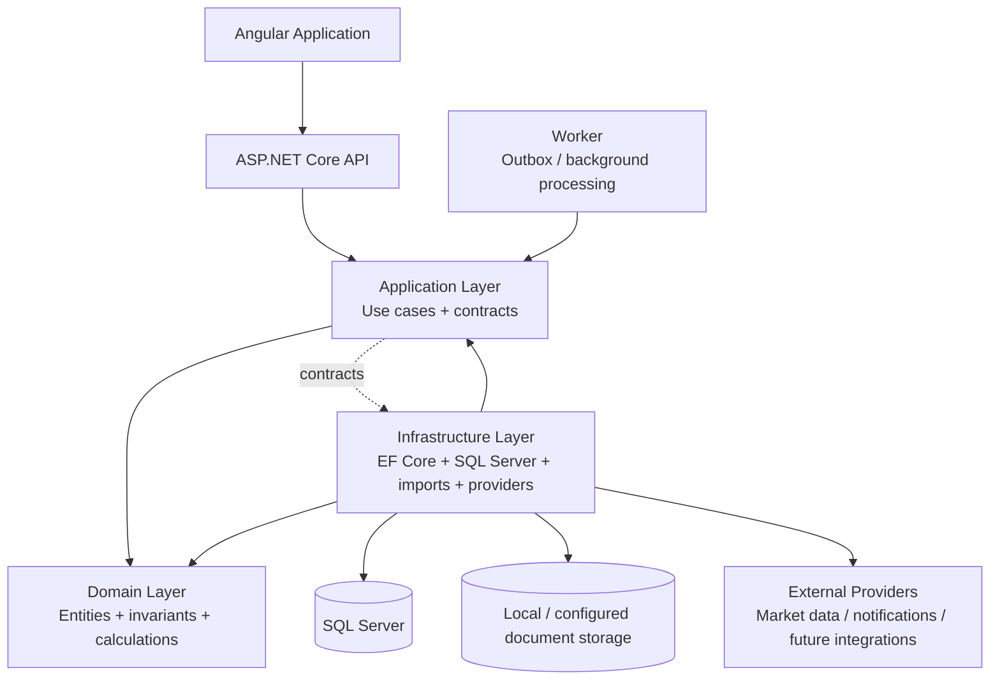

# Personal Wealth Platform

A production-oriented personal wealth management platform for consolidating banking, expenses, investments, assets, liabilities and wealth analytics into one auditable financial system.

The platform is intentionally being built as a **modular monolith first**, using Clean Architecture and pragmatic DDD. The goal is not to create distributed services prematurely. The goal is to establish strong business boundaries, deterministic calculations, tenant isolation, reliable imports and explicit contracts so individual capabilities can be extracted into microservices later when scale or operational ownership justifies it.

## What the platform is

The long-term platform covers:

- Banking: accounts, transactions, categorization, transfers and reconciliation.
- Expenses: categories, expenses, recurring rules, reporting and bank-transaction linking.
- Investments: investment accounts, securities, holdings, transactions, valuation and gain/loss.
- Assets: physical and financial assets with valuation history.
- Liabilities: loans, repayments, interest, credit cards and retirement-account modelling.
- Wealth engine: assets, liabilities, net worth, allocation, cash flow, savings and liquidity metrics.
- API: versioned application boundary for external clients and integrations.
- Angular application: dashboard and operational UI.
- Alerts and notifications: rule-driven financial alerts and delivery.
- AI interpretation: optional, bounded and auditable analysis over deterministic financial context.
- Operations: monitoring, diagnostics, deployment and production hardening.

The system is designed so that deterministic financial records remain the source of truth. AI is an interpretation layer, not the accounting system.

## Current implementation status

As of the current `main` branch:

| Phase | Area | Status |
|---|---|---|
| 0 | Engineering Foundation | Complete |
| 1 | Database Foundation | Complete |
| 2 | Events & Reliability | Complete |
| 3 | Documents & Deterministic Import | Complete |
| 4 | Banking | Complete |
| 5 | Expenses | Complete |
| 6 | Investments | **In progress** |
| 7 | Assets | Pending |
| 8 | Liabilities | Pending |
| 9 | Wealth Engine | Pending |
| 10 | API Foundation | Pending |
| 11 | Identity & Tenancy | Pending |
| 12 | Angular Application | Pending |
| 13 | Alerts & Notifications | Pending |
| 14 | AI Interpretation | Pending |
| 15 | Admin & Operations | Pending |
| 16 | Deployment & Production Hardening | Pending |

The ordered backlog contains 120 stories. 45 stories from Phases 0–5 are complete, and the first six Investment stories are now implemented, giving **51 completed stories with 69 remaining**. The source of truth is `docs/stories/MASTER_BACKLOG.md`; phase-specific story files are canonical where present.

## Current Investment milestone

Phase 6 is deliberately being implemented as a meaningful vertical capability rather than stopping after one domain class.

Implemented:

- `PW-INV-001` — investment account model.
- `PW-INV-002` — security/instrument master.
- `PW-INV-003` — holdings and transaction model.
- `PW-INV-004` — deterministic portfolio replay and investment business rules.
- `PW-INV-005` — Application-owned market-price provider abstraction.
- `PW-INV-006` — deterministic valuation and unrealized gain/loss.

The current implementation includes EF Core mappings, tenant-aware persistence registration, a source-controlled investment migration, deterministic portfolio replay, weighted-average cost accounting, market valuation and unit coverage.

Still pending in Phase 6:

- `PW-INV-007` — corporate-action handling foundation.
- `PW-INV-008` — investment import templates.
- `PW-INV-009` — investment reconciliation.
- `PW-INV-010` — investment integration tests.

## Architecture

The solution uses Clean Architecture with a modular-monolith deployment model.



The key dependency rule is:

```text
API -> Application -> Domain
Infrastructure -> Application / Domain
Worker -> Application
```

Domain does not depend on API, EF Core, SQL Server, filesystem, external provider SDKs, AI SDKs or notification SDKs.

## Module architecture

Business capabilities are kept as separate modules inside the monolith rather than as one undifferentiated application.

```text
PersonalWealth
├── Domain
│   ├── Banking
│   ├── Expenses
│   ├── Investments
│   ├── Assets              (planned)
│   ├── Liabilities         (planned)
│   └── Wealth              (planned)
│
├── Application
│   ├── Banking
│   ├── Expenses
│   ├── Investments
│   ├── Documents
│   └── Wealth               (planned)
│
├── Infrastructure
│   ├── Persistence
│   ├── Banking
│   ├── Expenses
│   ├── Documents
│   ├── Investments
│   └── External Providers   (future)
│
├── API
├── Worker
└── Contracts
```

This structure gives each future service candidate a natural boundary: Banking, Expenses, Investments, Wealth and other capabilities can be extracted behind stable Application contracts without first rewriting the domain model.

## Why it is microservice-ready

The platform is **not currently deployed as microservices**. It is deliberately a modular monolith. Microservice readiness means the internal architecture avoids the common migration traps that make extraction difficult later.

Current readiness characteristics:

1. **Business capabilities are modular.** Banking, Expenses and Investments have separate domain/application concerns.
2. **Domain logic is infrastructure-independent.** Investment accounting and valuation run without EF Core or an HTTP transport.
3. **Application contracts are explicit.** Provider and use-case abstractions form stable boundaries around business capabilities.
4. **Infrastructure is replaceable.** Persistence, file parsing and external providers stay outside the Domain.
5. **Tenant ownership is first-class.** TenantId is part of tenant-owned domain entities and persistence enforcement.
6. **Events and outbox reliability already exist.** This provides a foundation for asynchronous module-to-module or future service communication.
7. **Deterministic calculations are isolated.** Financial rules can be tested and replayed independently of transport and storage.
8. **API is intentionally later.** The current backlog keeps API exposure separate from core business-domain implementation, preventing controllers from becoming the architecture.

A future extraction can therefore look conceptually like:

```text
                    ┌──────────────────────┐
                    │ API / Gateway / BFF  │
                    └──────────┬───────────┘
                               │
          ┌────────────────────┼────────────────────┐
          ▼                    ▼                    ▼
   ┌─────────────┐      ┌─────────────┐      ┌─────────────┐
   │   Banking   │      │ Investments │      │   Expenses  │
   │   Service   │      │   Service   │      │   Service   │
   └──────┬──────┘      └──────┬──────┘      └──────┬──────┘
          │                    │                    │
          └──────────────┬─────┴──────────────┬─────┘
                         ▼                    ▼
                  Event / Integration     Wealth Engine
                       Boundary              Service
```

That is a future deployment option, not the current deployment topology.

## Financial design principles

- Canonical financial data is deterministic and auditable.
- Imports are deterministic and idempotent.
- Tenant isolation is enforced at the persistence boundary.
- Money uses explicit decimal precision rather than floating-point arithmetic.
- Calculations are replayable from canonical records.
- Provider integrations are behind abstractions.
- External market data is treated as an input snapshot to valuation, not as hidden state.
- AI analysis is optional and must operate over bounded financial context.

### Investment accounting v1

The current Investment milestone uses weighted-average cost per tenant/account/security position.

- Buy cost basis = quantity × unit price + buy fees.
- Sell cost = quantity sold × weighted-average cost.
- Net sell proceeds = quantity × unit price − sell fees.
- Realized gain/loss = net sell proceeds − cost of units sold.
- Dividend income is tracked separately.
- Open-position market value = quantity × approved market price.
- Unrealized gain/loss = market value − remaining cost basis.
- Financial outputs are rounded to four decimal places using banker's rounding.

The decision is documented in `docs/adr/ADR-INV-001-Investment-Accounting-Methodology.md`. FIFO/tax-lot accounting, currency conversion and provider-specific tax treatment are intentionally deferred.

## Data and tenant isolation

Tenant ownership is built into the domain model rather than added later. The existing `TenantEntity<TId>` contract requires a non-empty TenantId, and EF Core persistence applies tenant-aware query filtering and write validation.

This is important for a future multi-tenant deployment and for safe service extraction: tenant identity remains part of the business boundary rather than being inferred only from HTTP context.

## Reliability architecture

The platform already contains:

- Domain event contracts.
- In-process event dispatch.
- Transactional outbox.
- Outbox publisher worker.
- Processed-event/idempotency handling.
- Deterministic document import lifecycle.
- Duplicate detection.
- Integration and architecture tests.

These mechanisms provide the reliability foundation needed before introducing distributed communication.

## Testing strategy

Testing is layered:

```text
Domain tests
    ↓
Application/use-case tests
    ↓
Infrastructure integration tests
    ↓
Architecture tests
    ↓
Future API contract/integration tests
```

The Investment milestone adds unit coverage for weighted-average cost, sell constraints, deterministic replay, valuation and missing-price failures.

The latest Expense follow-up also corrected the recurring-expense end-date test to match the implementation's inclusive end-date contract. The corrected test should still be validated locally because the current GitHub state does not provide an Actions result for the latest merge commit.

## Development roadmap

The project follows this sequence unless an ADR explicitly changes a dependency:

```text
Foundation
   ↓
Database + Reliability
   ↓
Documents / Imports
   ↓
Banking
   ↓
Expenses
   ↓
Investments  ← current milestone
   ↓
Assets
   ↓
Liabilities
   ↓
Wealth Engine
   ↓
API Foundation
   ↓
Identity / Tenancy
   ↓
Angular Application
   ↓
Alerts / Notifications
   ↓
AI Interpretation
   ↓
Admin / Operations
   ↓
Production Hardening
```

The next logical Investment work is corporate actions → deterministic investment imports → reconciliation → full integration tests. The API and UI remain intentionally later phases.

## Engineering rules

- Clean Architecture and SOLID are mandatory.
- Domain remains independent of infrastructure and transport.
- Database design is derived from business/domain requirements, not UI screens.
- EF Core is Code First.
- Migrations are source-controlled.
- Tenant isolation is mandatory for tenant-owned data.
- Financial calculations must be deterministic and testable.
- Secrets are never committed.
- External provider SDKs remain in Infrastructure.
- AI must not become a source of truth for financial records.
- Future features must not be silently implemented ahead of their backlog stories.

## Repository structure

```text
src/
  PersonalWealth.Api/
  PersonalWealth.Application/
  PersonalWealth.Contracts/
  PersonalWealth.Domain/
  PersonalWealth.Infrastructure/
  PersonalWealth.Shared/
  PersonalWealth.Worker/

tests/
  PersonalWealth.UnitTests/
  PersonalWealth.IntegrationTests/
  PersonalWealth.ArchitectureTests/

docs/
  adr/
  stories/
```

## Source of truth

- `docs/stories/MASTER_BACKLOG.md` — ordered implementation backlog.
- `docs/stories/STORY_SPECIFICATIONS.md` — consolidated story contract.
- `docs/stories/<PHASE>/` — canonical detailed story specifications where present.
- `docs/stories/IMPLEMENTATION_STATUS.md` — implementation status and validation notes.
- `docs/adr/` — architectural decisions that intentionally resolve design choices not fully specified by the backlog.
- `AGENT_RULES.md` — repository engineering rules.

## Current branch

Development is currently being advanced directly on `main` as a coherent sequence of production-oriented checkpoints. The current checkpoint establishes the first meaningful Investment vertical: domain model → persistence mapping → deterministic accounting engine → market-price abstraction → valuation → tests.
