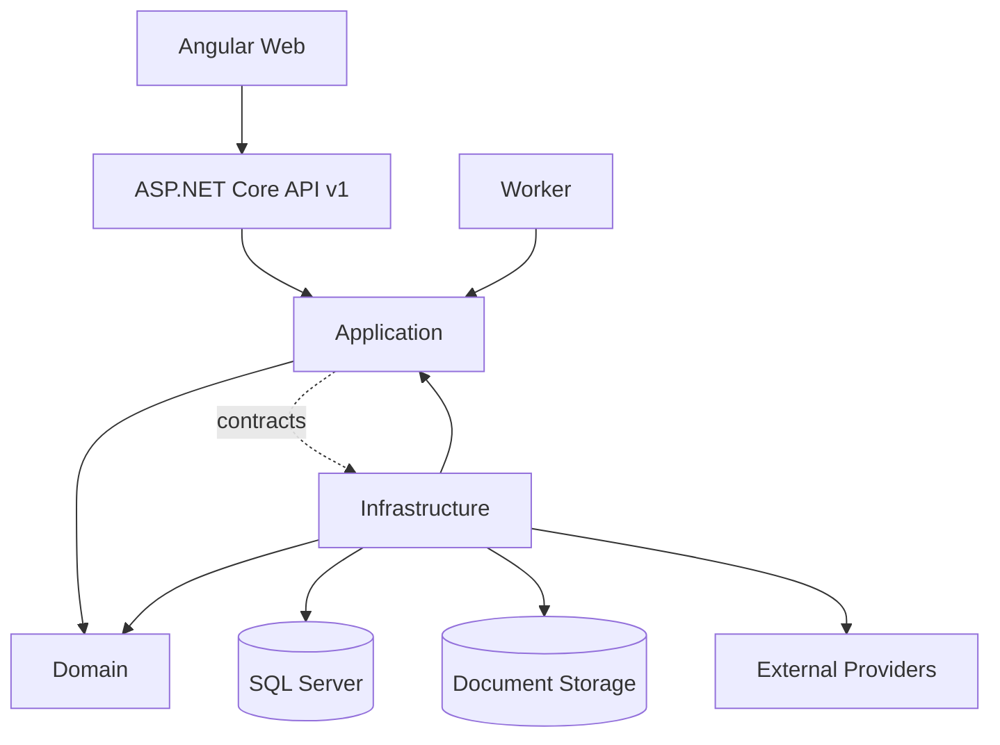

# Personal Wealth Platform

Production-oriented personal wealth management platform for banking, expenses, investments, assets, liabilities and wealth analytics. The solution is a modular monolith built with Clean Architecture and pragmatic DDD so business capabilities can later be extracted into independently deployable services without rewriting the domain.

## Checkpoint status

Phases 0–5 were already complete. This feature branch completes Phases 6–12 as one coherent vertical checkpoint: Investments → Assets → Liabilities → Wealth Engine → API → Identity/Tenancy → Angular UI.

| Phase | Status | Outcome |
|---|---|---|
| 0–5 | Complete | Foundation, persistence, reliability, imports, banking, expenses |
| 6 | Complete | Investment accounting, corporate actions, import validation, reconciliation, valuation |
| 7 | Complete | Assets, valuation history and ownership rules |
| 8 | Complete | Loans, repayments, interest schedules, credit-card/EPF/NPS modelling |
| 9 | Complete | Net worth, allocation, cash flow, savings, debt/liquidity ratios, history |
| 10 | Complete | Versioned API, validation/error boundary, auth boundary, banking/wealth/import APIs |
| 11 | Complete | Tenant/user model, tenant resolution, authorization boundary, secure configuration |
| 12 | Complete | Angular shell, typed API client, routed financial screens and wealth dashboard |
| 13–16 | Pending | Alerts, AI, admin/operations and production hardening |

The master backlog contains 120 stories. 95 are implemented through Phase 12; 25 remain in Phases 13–16.

## Architecture



Dependency rule: `API -> Application -> Domain`, `Infrastructure -> Application/Domain`, `Worker -> Application`. Domain does not depend on HTTP, EF Core, SQL Server, filesystem or provider SDKs.

## Module boundaries

```text
Domain
├─ Banking
├─ Expenses
├─ Investments
├─ Assets
├─ Liabilities
└─ Identity

Application
├─ Banking / Expenses / Documents / Investments
├─ Assets / Liabilities / Wealth
└─ Tenancy

Infrastructure
├─ Persistence / Migrations
├─ Banking / Expenses / Documents
├─ Investments / Wealth
└─ Tenancy / external integration boundaries

API
├─ v1/banking
├─ v1/investments
├─ v1/imports
└─ v1/wealth/dashboard

Web
└─ web/PersonalWealth.Web
```

## Phase 6 — Investments

Investment v1 uses weighted-average cost per tenant/account/security. Buy cost basis includes fees; sells calculate cost at weighted-average cost; dividends and fees remain explicit; valuation consumes approved market-price snapshots. Phase 6 now also contains:

- corporate-action foundation for split/bonus/symbol/name changes;
- deterministic investment import validation;
- quantity/cost-basis reconciliation with tolerances;
- unit and persistence smoke tests;
- source-controlled migrations.

## Phase 7 — Assets

Assets support physical/financial asset identity, acquisition basis, tenant ownership, current valuation and historical valuation snapshots. Latest valuation selection is deterministic by date and identity, with acquisition value as the fallback.

## Phase 8 — Liabilities

Liabilities model mortgage, personal loan, credit card, education loan, EPF and NPS balances. Repayments explicitly split principal and interest. The loan schedule engine calculates monthly interest, principal and remaining balance using decimal rounding and deterministic periods.

## Phase 9 — Wealth Engine

The wealth layer is deterministic and independent from transport. It calculates total assets, liabilities, net worth, cash flow, savings rate, debt-to-asset ratio and liquidity ratio. Allocation, concentration, growth and historical ordering are separate analytical functions so they can later become a dedicated Wealth service.

## Phase 10 — API

The API is versioned under `/api/v1`. It exposes banking accounts/transactions, investment accounts/securities/holdings, investment import validation and the wealth dashboard. Problem-details handling provides a stable error boundary, while JWT bearer authentication establishes the production authentication boundary.

## Phase 11 — Identity and tenancy

Tenant and user identity are first-class domain models. Tenant resolution reads the authenticated `tenant_id` claim and supports the explicit tenant header boundary used by infrastructure. Tenant-owned writes remain protected by the existing persistence enforcement and query filters. Authentication authority, audience and other secrets are configuration-driven; no secrets are committed.

## Phase 12 — Angular

`web/PersonalWealth.Web` is a standalone Angular application with typed API access, router navigation and screens for dashboard, banking, expenses, investments, assets, liabilities and imports. The UI remains a client of the API and does not own financial calculations.

## Microservice readiness

The application is not deployed as microservices. It is deliberately a modular monolith. It is microservice-ready because business capabilities have explicit boundaries, deterministic calculations are isolated, tenant identity is part of the domain contract, Infrastructure owns persistence/provider details, and the existing event/outbox foundation can support future asynchronous integration.

A future extraction can therefore separate Banking, Investments, Expenses and Wealth behind API/event contracts without moving accounting rules into controllers.

## Reliability and financial rules

Canonical financial data is deterministic and auditable. Imports are designed to be idempotent. Money uses decimal precision. Calculations are replayable from canonical records. External market data is an input snapshot, not hidden accounting state. AI, when added in Phase 14, must remain an interpretation layer over deterministic financial context.

## Validation status

This branch was created from the latest `main` and contains all Phase 6–12 changes. The available GitHub integration does not provide a local `dotnet build`/`dotnet test` execution environment, and no green CI result is claimed until GitHub Actions validates the branch/PR. The PR is intentionally left unmerged.

## Documentation

- `docs/stories/MASTER_BACKLOG.md` — ordered status map.
- `docs/stories/IMPLEMENTATION_STATUS.md` — implementation and validation status.
- `docs/stories/INV/` — investment stories.
- `docs/stories/ASSET/` — asset stories.
- `docs/stories/LIAB/` — liability stories.
- `docs/stories/WEALTH/` — wealth-engine stories.
- `docs/stories/API/` — API stories.
- `docs/stories/AUTH/` — identity/tenancy stories.
- `docs/stories/UI/` — Angular stories.
- `docs/adr/` — architectural decisions.
- `AGENT_RULES.md` — engineering constraints.

## Branching

All Phase 6–12 work is contained in one feature branch: `feature/phases-6-12-complete`. `main` has not been directly modified by this checkpoint. A single PR targets `main`; it is not merged automatically.
